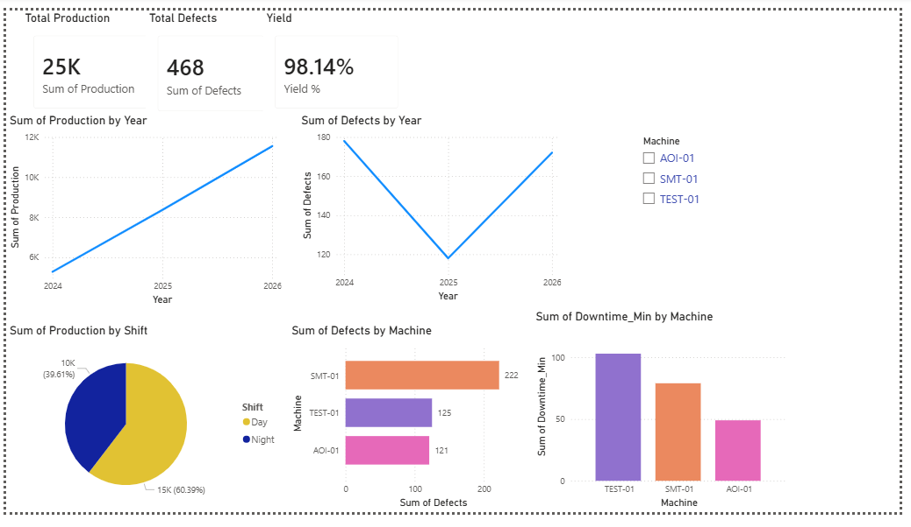

# Manufacturing Power BI Dashboard (Self-Learning Project)

## Overview
This project is a self-learning Power BI dashboard built to practice data visualization and KPI analysis using a simulated manufacturing dataset.

## Objectives
- Learn Power BI basics
- Create dashboards using charts and KPIs
- Practice DAX formulas
- Understand manufacturing metrics

## Tools Used
- Power BI Desktop
- Excel
- DAX

## Features
- Production tracking
- Defect analysis
- Yield calculation
- Machine performance comparison

## Key Visuals
- KPI Cards
- Line Chart (Trends)
- Bar Chart (Machine defects)
- Pie Chart (Shift distribution)
  
## 📊 Dashboard Preview

## Disclaimer
This is a self-learning project created for practice purposes using simulated data.
